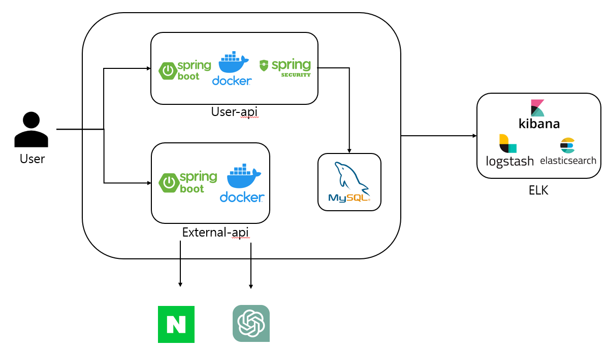

# 트렌드 분석 리포트 생성 서비스

사용자의 관심사에 해당하는 분야의 트렌드 리포트를 생성하는 서비스입니다.

네이버 통합 검색어 트렌드 api를 통해 데이터를 받고, openAI에 전달함으로써 
간단한 트렌드 리포트를 생성하는 서버입니다.

자세한 구현 내용은 RP과 Issue를 통해 확인할 수 있습니다.

## 프로젝트 구성

- 사용자와 관련된 로직이 있는 모듈과 외부 통신을 하는 모듈을 나눠 구성하였습니다
- 사용자 로그인은 JWT를 사용하여 token을 통해 진행합니다
- 네이버 api를 통해 받은 데이터를 spring ai를 사용하여 openAI에 prompt로 전송하고, 이에 해당하는 값을 전달합니다.

## 프로젝트의 주요 관심사
### 공통사항

- 성능을 고려한 개발
- 오류가 발생할 여지가 있는 코드에 대한 리팩토링

### 코드 컨벤션

- 메소드명, 변수명 등이 어떤 역할을 하는지 명확하게 알 수 있게 명명
- 코드가 타 개발자가 보기에 명확한지
- Gooole code Style을 준수

### 브랜치 관리 전략
개발을 진행하기 전 Issue를 생성한 후 해당되는 개발을 진행합니다
모든 브랜치는 Pull Request에 리뷰를 진행한 후 merge를 진행합니다

자세한 개발 내용을 확인하고 싶다면 Issue와 PR을 확인해주세요

Issues : https://github.com/f-lab-edu/trend-report/issues

PR : https://github.com/f-lab-edu/trend-report/pulls

### Tech Stack

 
   
  
  
  
   
  
  
  

