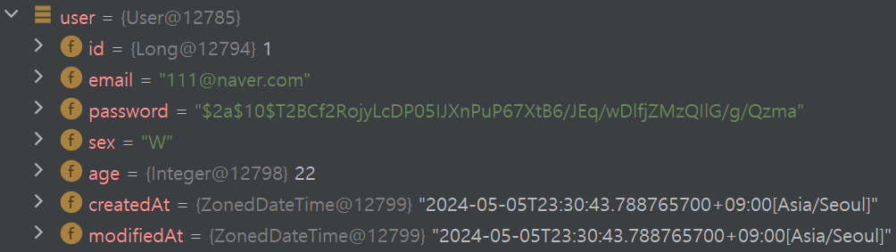
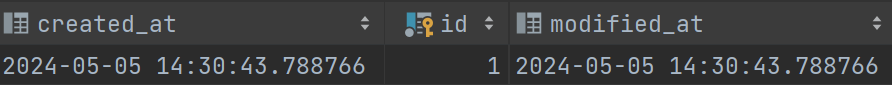

# TroubleShooting

### BaseEntity의 Create, Modify 시간 UTC 설정
#### Issue #1
DB에 저장하기 전에는 KST(UTC+9)로 user값이 세팅되어있었으나, DB에 저장시게 UTC +0로 저장이됨

- DB에 저장 전

- DB에 저장 후

#### Solution #1
- 기존의 코드
```java
public class BaseEntity {
    private ZonedDateTime createdAt;
    private ZonedDateTime modifiedAt;
}
```
- 변경한 코드
```java
public class BaseEntity {
    private Timestamp createdAt;
    private Timestamp modifiedAt;
}
```
기존의 코드의 날짜 데이터 형식은 ZonedDateTime이었습니다. 이를 Timestamp 데이터형으로 변경하였습니다.
왜 이런 문제가 발생했는지에 대한 자세한 문제 원인을 찾지못했으나, 개인적인 견해로는 Jpa에서 DB로 데이터를 저장할 때, DB의 데이터 형에 맞춰 변환을 하게되는데
이 과정에서 ZonedDateTime -> datetime으로의 문제가 발생한 것으로 보입니다.

따라서 형 변환을 하여 저장하기 용이한 Timestamp로 데이터형을 바꾸었더니 문제가 해결되었습니다.
- - -